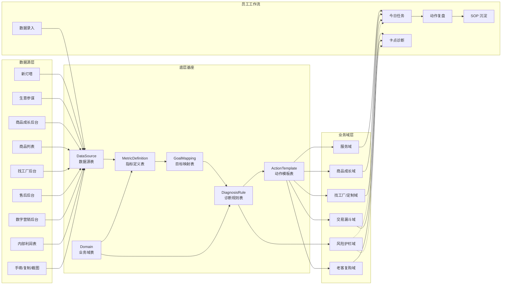
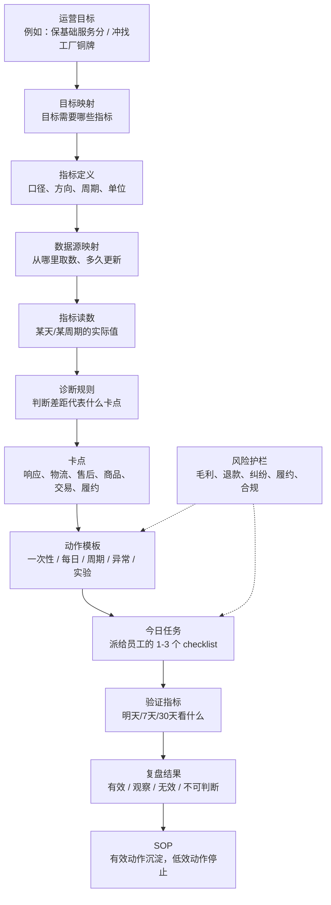
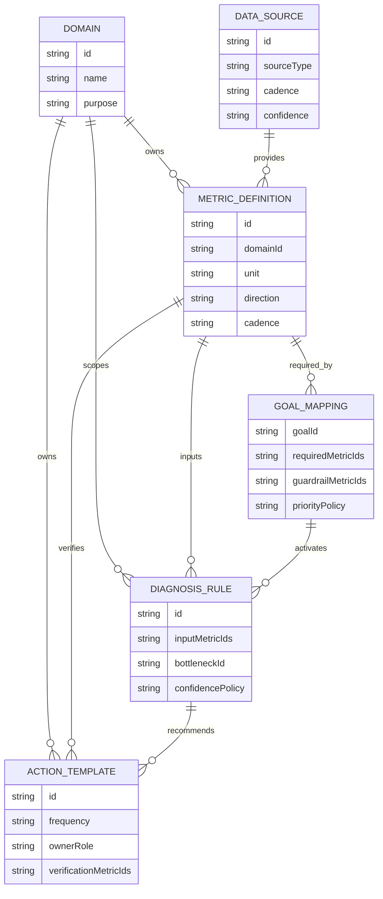
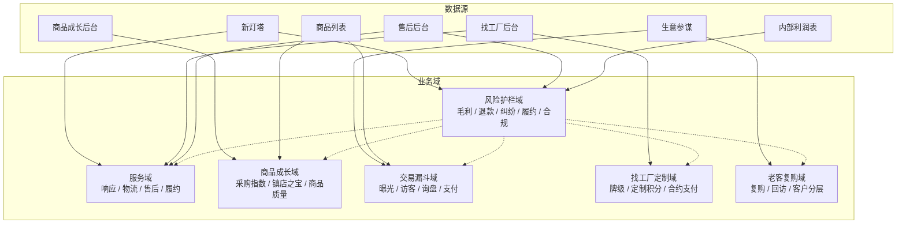

# 1688 运营助手领域基座 V1

本文档用于冻结第一版底层基座。它不描述某一天的具体数值，也不描述当前页面应该长什么样，而是定义系统长期如何认识经营对象、数据来源、目标、指标、动作和诊断。

实施计划：

- `docs/plans/2026-05-25-domain-foundation-v1-implementation-plan.md`

核心判断：

```text
业务域负责经营问题。
数据源负责数据从哪里来。
指标定义负责这个数是什么意思。
目标映射负责为什么要看它。
诊断规则负责怎么判断卡点。
动作模板负责怎么处理。
回测规则负责怎么验证有没有用。
```

## 0. 总览图

这套图更准确的名字是：

```text
领域架构图 + 数据流图
```

它不是页面原型图，也不是数据库 ER 图。它表达的是：系统如何从平台数据和内部数据，推导出目标、卡点、动作和复盘。



## 0.1 目标到动作的推导图

这张图是产品的核心闭环。它防止系统从“目标”直接跳到“任务”，避免变成死规则。



## 0.2 六张底层表关系图

这张图接近数据模型图，但不是数据库设计稿。它先约束概念关系，后续再决定用 TS seed、JSON、数据库还是后台配置。



## 0.3 业务域与数据源关系图

这张图回答“新灯塔到底算什么”。结论：新灯塔是数据源，服务域才是业务域。



## 1. 设计原则

1. 不按平台页面建模块。新灯塔、生意参谋、商品成长后台、找工厂后台都是数据源，不是一级经营模块。
2. 不按当前数值建模块。当前咨询体验、响应率、采购指数等数值只进入 `MetricReading`，不进入基座定义。
3. 不让目标直接跳到动作。必须经过 `目标 -> 指标 -> 数据 -> 卡点 -> 动作 -> 验证`。
4. 风险护栏是横切层。毛利、退款、纠纷、履约、广告费率、合规风险会影响所有业务域。
5. 动作必须有频率。一次性配置、每日运营、周期巡检、异常触发、实验动作不能混在一起派发。
6. 官方规则必须版本化。规则可以影响目标和阈值，但不能把旧规则当永久真理。
7. 员工端只看作战单。底层表服务于系统判断，不应该全部暴露给一线员工。

## 2. 六张底层表

### 2.1 业务域表 `Domain`

定义系统长期关心的经营问题域。

| 字段 | 说明 |
| --- | --- |
| `id` | 稳定 ID，例如 `service`、`product_growth`。 |
| `name` | 中文名。 |
| `purpose` | 这个域解决什么经营问题。 |
| `primaryMetricIds` | 该域的一线判断指标。 |
| `sourceIds` | 常见数据源。 |
| `ownerRoles` | 常见负责人角色。 |
| `guardrailMetricIds` | 受哪些风险护栏约束。 |

第一批业务域：

| ID | 名称 | 解决的问题 |
| --- | --- | --- |
| `service` | 服务域 | 响应、物流、售后、履约、服务星级。 |
| `product_growth` | 商品成长域 | 采购指数、商品质量、镇店之宝、商品扶持门槛。 |
| `trade_funnel` | 交易漏斗域 | 曝光、访客、询盘、支付、GMV、广告消耗。 |
| `factory_custom` | 找工厂/定制域 | 找工厂牌级、定制交易、合约支付、小单定制商品。 |
| `customer_repeat` | 老客复购域 | 老客、复购、补单、回访、客户分层。 |
| `guardrail` | 风险护栏域 | 毛利、退款、纠纷、履约、广告费率、合规。 |

注意：`guardrail` 既可作为业务域建模，也会横向约束其他域。

### 2.2 数据源表 `DataSource`

定义指标从哪里来，以及数据可信度、录入方式和更新频率。

| 字段 | 说明 |
| --- | --- |
| `id` | 稳定 ID，例如 `new_lighthouse`。 |
| `name` | 数据源名称。 |
| `sourceType` | `manual`、`xls`、`copy_table`、`screenshot`、`api`。 |
| `ownerRole` | 谁负责录入或维护。 |
| `cadence` | 日、周、月、近 30 天、实时。 |
| `freshnessRule` | 多久没更新视为过期。 |
| `confidence` | `low`、`medium`、`high`。 |
| `providedMetricIds` | 可提供的指标。 |
| `sourceUrl` | 后台入口或官方链接，可为空。 |

第一批数据源：

| ID | 名称 | 归属 |
| --- | --- | --- |
| `new_lighthouse` | 新灯塔页面 | 服务域数据源。 |
| `sycm_core_board` | 生意参谋首页核心看板 | 交易漏斗数据源。 |
| `product_growth_backend` | 商品成长后台 | 商品成长数据源。 |
| `product_list` | 商品管理/商品列表 | 商品级经营数据源。 |
| `factory_workbench` | 找工厂后台 | 找工厂/定制数据源。 |
| `after_sales_backend` | 退款售后后台 | 服务域和风险护栏数据源。 |
| `ad_backend` | 数字营销后台 | 交易漏斗和风险护栏数据源。 |
| `internal_profit_sheet` | 内部利润表 | 风险护栏数据源。 |
| `manual_input` | 手填数据 | 过渡期数据源。 |

### 2.3 指标定义表 `MetricDefinition`

定义每个指标的含义，不保存某一天的值。

| 字段 | 说明 |
| --- | --- |
| `id` | 稳定 ID。 |
| `name` | 指标名。 |
| `domainId` | 所属业务域。 |
| `sourceIds` | 可能来自哪些数据源。 |
| `unit` | `%`、`score`、`count`、`money`、`hour` 等。 |
| `direction` | `higher_is_better`、`lower_is_better`、`target_range`。 |
| `cadence` | 指标周期。 |
| `definition` | 指标口径。 |
| `isOfficialMetric` | 是否来自平台官方规则或后台。 |
| `canBeGoalMetric` | 是否可作为目标达成指标。 |
| `canBeVerificationMetric` | 是否可作为动作验证指标。 |
| `guardrailLevel` | 无、观察、阻断。 |

示例：

| ID | 名称 | 业务域 | 数据源 |
| --- | --- | --- | --- |
| `lighthouse_score` | 新灯塔分 | `service` | `new_lighthouse` |
| `consultation_experience_score` | 咨询体验分 | `service` | `new_lighthouse` |
| `ww_3min_response_rate` | 旺旺 3 分钟响应率 | `service` | `new_lighthouse`、`manual_input` |
| `refund_processing_duration` | 退款处理时长 | `service` | `new_lighthouse`、`after_sales_backend` |
| `purchase_index` | 采购指数 | `product_growth` | `product_growth_backend` |
| `town_treasure_quota` | 镇店之宝配额 | `product_growth` | `product_growth_backend` |
| `total_exposure` | 总曝光 | `trade_funnel` | `sycm_core_board` |
| `visitors` | 访客 | `trade_funnel` | `sycm_core_board` |
| `inquiries` | 询盘 | `trade_funnel` | `sycm_core_board` |
| `payments` | 支付订单数 | `trade_funnel` | `sycm_core_board` |
| `factory_service_response_rate` | 找工厂服务响应率 | `factory_custom` | `factory_workbench` |
| `contract_payment_rate` | 合约支付率 | `factory_custom` | `factory_workbench` |
| `repeat_purchase_rate` | 复购率 | `customer_repeat` | `trade_backend`、`manual_input` |
| `gross_margin_rate` | 毛利率 | `guardrail` | `internal_profit_sheet` |
| `intervention_rate` | 平台介入率 | `guardrail` | `new_lighthouse`、`after_sales_backend` |

### 2.4 目标映射表 `GoalMapping`

定义一个目标由哪些指标决定，以及如何排序缺口。

| 字段 | 说明 |
| --- | --- |
| `goalId` | 目标 ID。 |
| `name` | 目标名。 |
| `domainIds` | 涉及哪些业务域。 |
| `requiredMetricIds` | 硬门槛指标。 |
| `supportingMetricIds` | 辅助判断指标。 |
| `guardrailMetricIds` | 阻断或预警指标。 |
| `ruleVersionIds` | 相关规则版本。 |
| `priorityPolicy` | 缺口排序规则。 |
| `applicableScope` | 类目、店铺阶段、商品类型等适用范围。 |

目标示例：

| 目标 | 业务域 | 硬门槛 | 风险护栏 |
| --- | --- | --- | --- |
| 保基础服务分 | `service` | 新灯塔分、咨询/物流/售后体验 | 介入率、退款率、履约风险 |
| 冲找工厂铜牌 | `factory_custom`、`service` | 找工厂响应率、履约率、定制交易积分、合约支付率 | 毛利率、履约风险、售后风险 |
| 提升 L 等级 | `trade_funnel`、`service`、`product_growth` | 生意积分、服务健康指标、商品健康指标 | 违规、纠纷、退款 |
| 冲采购指数 4.0 商品 | `product_growth` | 采购指数、品质、服务、价格、口碑、商誉 | 品质退款、履约风险 |
| 成交增长 | `trade_funnel` | 曝光、访客、询盘、支付、GMV | 毛利率、广告费率、退款率 |

### 2.5 动作模板表 `ActionTemplate`

定义可复用动作，不定义今天谁已经做了。

| 字段 | 说明 |
| --- | --- |
| `id` | 动作模板 ID。 |
| `domainId` | 适用业务域。 |
| `bottleneckIds` | 对应卡点。 |
| `metricIds` | 主要影响指标。 |
| `frequency` | `one_time_setup`、`daily_operation`、`periodic_check`、`exception_triggered`、`experiment`。 |
| `ownerRole` | 运营、客服、负责人。 |
| `checklist` | 低摩擦执行项。 |
| `verificationMetricIds` | 做完后看什么。 |
| `verificationWindow` | 明天、3 天、7 天、30 天。 |
| `evidencePolicy` | `none`、`optional_note`、`required_note`、`screenshot_required`。 |
| `stopPolicy` | 什么情况下停止派发。 |

动作频率定义：

| 频率 | 说明 | 示例 |
| --- | --- | --- |
| `one_time_setup` | 配置完成后不应每日派发。 | 开通基础保障、补商品必填属性。 |
| `daily_operation` | 每天需要处理。 | 回复询盘、退款日清、待发货日清。 |
| `periodic_check` | 到周期才复核。 | 每周看新灯塔、每周看商品成长。 |
| `exception_triggered` | 指标越线才派发。 | 介入率升高、物流异常、服务星级下降。 |
| `experiment` | 需要观察效果。 | 改标题、主图、报价模板、详情页。 |

### 2.6 诊断规则表 `DiagnosisRule`

定义如何从指标读数推导卡点。

| 字段 | 说明 |
| --- | --- |
| `id` | 诊断规则 ID。 |
| `domainId` | 所属业务域。 |
| `inputMetricIds` | 输入指标。 |
| `condition` | 判断条件。 |
| `bottleneckId` | 输出卡点。 |
| `severityPolicy` | P0/P1/P2/P3 如何判定。 |
| `confidencePolicy` | 高、中、低置信度如何判定。 |
| `recommendedActionTemplateIds` | 推荐动作模板。 |
| `fallbackWhenMissingData` | 数据缺失时怎么降级。 |
| `guardrailChecks` | 需要同时检查哪些风险护栏。 |

诊断规则不直接生成员工任务。它只输出卡点和候选动作，最终由 `Mission` 根据目标、频率、风险、负责人和历史效果生成今日 checklist。

## 3. 两个目标跑通示例

### 3.1 目标：保基础服务分

```text
GoalMapping
  goalId: protect_service
  domains: service + guardrail
  requiredMetrics:
    - lighthouse_score
    - consultation_experience_score
    - logistics_experience_score
    - after_sales_experience_score
  guardrails:
    - intervention_rate
    - refund_processing_duration
    - fulfillment_rate

DataSource
  - new_lighthouse
  - after_sales_backend
  - manual_input

Diagnosis
  服务分低
    -> 判断是咨询、物流、售后、商品体验还是特色保障短板
    -> 输出 service_bottleneck

Action
  根据卡点选择响应、退款、物流、售后动作模板

Verification
  明天或近 30 天看同一指标是否改善
```

这里不写当前分数。当前分数只属于 `MetricReading`。

### 3.2 目标：冲找工厂铜牌

```text
GoalMapping
  goalId: factory_bronze
  domains: factory_custom + service + guardrail
  requiredMetrics:
    - factory_service_response_rate
    - factory_fulfillment_rate
    - custom_trade_points
    - contract_payment_rate
    - active_small_custom_sku_count
  supportingMetrics:
    - ww_3min_response_rate
    - consultation_experience_score
  guardrails:
    - gross_margin_rate
    - fulfillment_risk
    - refund_rate

DataSource
  - factory_workbench
  - new_lighthouse
  - product_list
  - internal_profit_sheet

Diagnosis
  找工厂缺口
    -> 判断是响应、履约、交易积分、合约支付还是货盘不足
    -> 同时检查毛利和履约风险

Action
  输出定制承接、合约支付、定制商品、客服响应、履约动作模板

Verification
  近 30 天滚动指标 + 明日执行状态
```

这个目标不能只归入找工厂域，因为响应和履约来自服务域，毛利和退款来自风险护栏。

## 4. 与页面的关系

页面是这些底层表的投影。

| 页面 | 消费的底层对象 |
| --- | --- |
| 今日任务 | `GoalMapping`、`DiagnosisRule`、`ActionTemplate`、`Mission` |
| 数据录入 | `DataSource`、`MetricDefinition`、`MetricReading` |
| 卡点诊断 | `MetricReading`、`DiagnosisRule`、`Bottleneck` |
| 商品诊断 | `Domain(product_growth)`、商品级指标、商品动作模板 |
| 动作复盘 | `ExecutionLog`、`VerificationRule`、`SOP` |
| 规则维护 | `RuleVersion`、`GoalMapping`、`MetricDefinition` |

因此 UI 不应该维护业务规则。UI 只负责呈现当前目标、关键指标、卡点、动作和验证结果。

## 5. 后续软件化顺序

第一批不急着把所有业务域做完，只先把基座对象落到代码里。

1. 新增 `DomainDefinition`、`DataSourceDefinition`、`MetricDefinition`、`GoalMapping`、`ActionTemplate`、`DiagnosisRule` 类型。
2. 用 TS seed 文件承载第一批配置，不直接上数据库。
3. 把现有 `operations.ts` 中的指标、目标、动作和规则逐步迁到 seed。
4. 先用 `protect_service` 和 `factory_bronze` 两个目标验收。
5. 页面继续保持 6 个入口，但逐步改为读取配置输出。

建议文件结构：

```text
src/domain/core/types.ts
src/domain/core/domains.ts
src/domain/core/dataSources.ts
src/domain/core/metrics.ts
src/domain/core/goalMappings.ts
src/domain/core/actionTemplates.ts
src/domain/core/diagnosisRules.ts
src/domain/service/
src/domain/productGrowth/
src/domain/tradeFunnel/
src/domain/factoryCustom/
src/domain/customerRepeat/
src/domain/guardrails/
```

## 6. 暂不做

1. 不把新灯塔做成一级模块。
2. 不把当前页面数值写入基座。
3. 不把 AI 摘要里的未经核验数字写成规则。
4. 不做复杂自定义规则编辑器。
5. 不做 API 优先架构。
6. 不要求员工维护规则来源。
7. 不把所有动作都做成每日任务。

## 7. 当前冻结结论

第一版模块化采用：

```text
业务域：
  服务域
  商品成长域
  交易漏斗域
  找工厂/定制域
  老客复购域
  风险护栏域

数据源：
  新灯塔
  生意参谋
  商品成长后台
  商品列表
  找工厂后台
  售后后台
  数字营销后台
  内部利润表
  手填

推导链路：
  目标 -> 指标 -> 数据源 -> 读数 -> 卡点 -> 动作 -> 验证 -> SOP
```

这份基座冻结后，下一步才进入代码迁移计划。
